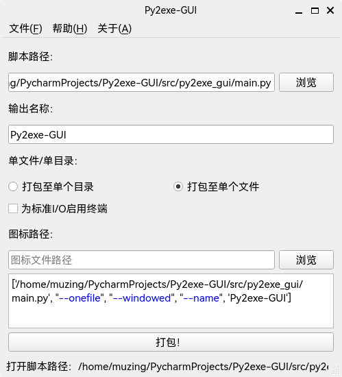

<h2 align="center">强大易用的 Python 图形界面打包工具</h2>

<p align="center">


<a href="https://pypi.org/project/py2exe-gui/"></a>
<a href="https://doc.qt.io/qtforpython/index.html"></a>
<a href="https://github.com/psf/black"></a>
<a href="http://mypy-lang.org/"></a>
</p>

## 简介

Py2exe-GUI 是一个基于 [PySide6](https://doc.qt.io/qtforpython/index.html) 开发的 [PyInstaller](https://pyinstaller.org/) 辅助工具，旨在提供完整易用的图形化界面，方便用户进行 Python 项目的打包。



有如下特性：

- 完全图形化界面，易用
- 支持 PyInstaller 的全部选项
- 可以调用本地任何一个 Python 解释器，无需在每个待打包的解释器环境中重复安装（暂未实现）
- 跨平台，Windows、Linux、MacOS 均支持

## 如何使用

### 安装

首先在待打包的 Python 解释器环境中安装 PyInstaller:

```shell
pip install pyinstaller
```

然后通过 pip 安装：

```shell
pip install py2exe-gui
```

### 运行

```shell
python -m py2exe_gui
```

## 项目结构

- 项目所有代码均在 [py2exe_gui](src/py2exe_gui) 目录下
- [Widgets](src/py2exe_gui/Widgets) 目录下包含所有界面控件
- [Core](src/py2exe_gui/Core) 目录中为执行打包的代码

仅为图形化界面工具，不依赖于需要打包的 Python 环境。也提供 exe 发布版。

可以显式指定打包时使用的 Python 解释器与对应环境
（调用该解释器的 `python3 -m PyInstaller myscript.py` 即可）

## TODO

- [ ] 解决相对引用与作为包运行问题
- [x] 选项参数获取
  - [x] 将参数拼接成完整调用命令
  - [x] 参数预览器控件
  - [ ] 优化拼接代码
- [x] 调用 `PyInstaller` 子进程
  - [x] 使用 `QProcess` 替代 `subprocess` 以解决界面卡死问题
  - [x] 将子进程的输出与状态显示至单独的弹出窗口
  - [ ] 完善 `SubProcessDlg`，增加取消按钮、进度条
  - [ ] 优化子进程相关代码，增强异常处理
- [ ] 增加主界面功能控件
  - [ ] 资源文件添加框
  - [ ] Python 解释器选择器
  - [ ] 增加状态栏信息
  - [ ] 「简洁模式」/「详尽模式」切换
- [ ] 菜单栏功能
  - [ ] `PyInstaller` 选项参数详解表格
  - [ ] 打包任务读写
- [ ] 实现跨平台功能
  - [x] 获取当前运行平台
  - [ ] 以合理方式保存至某种全局变量中
  - [ ] 定制各平台特有功能
- [ ] 打包任务
  - [ ] 创建打包任务，保存所有选项
  - [ ] 定义文件并以适当格式存储（`json`）
  - [ ] 导入导出功能
- [ ] `logging` 日志记录
- [ ] QSS 与美化
- [ ] 翻译与国际化
